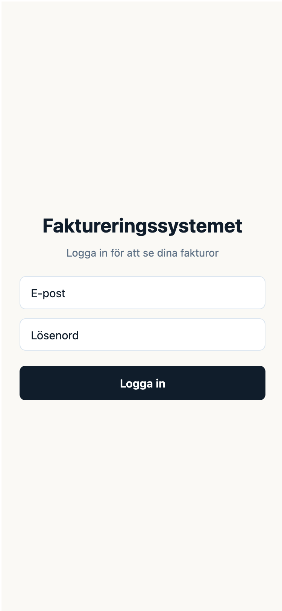
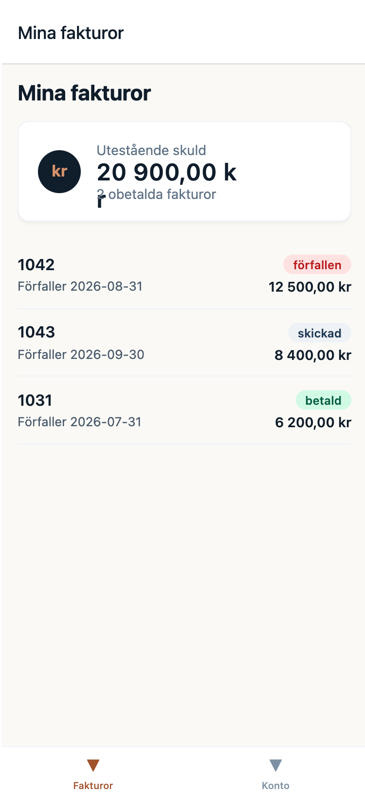
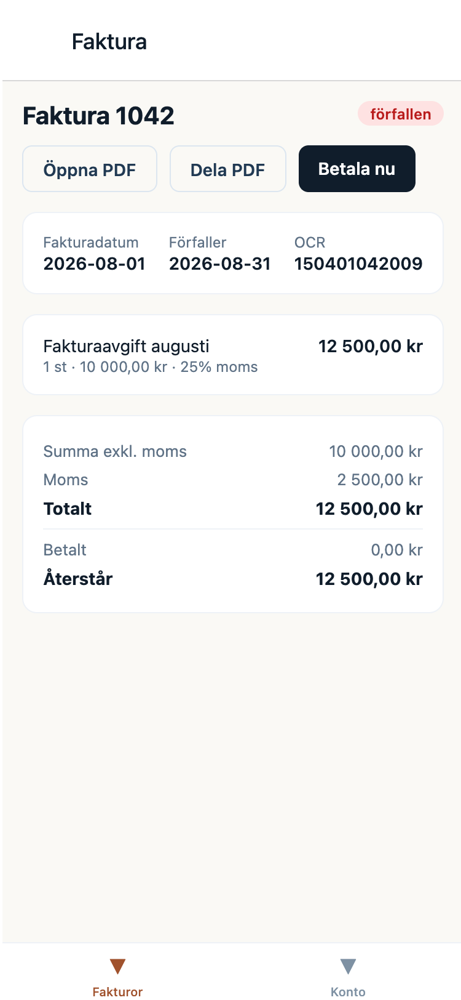
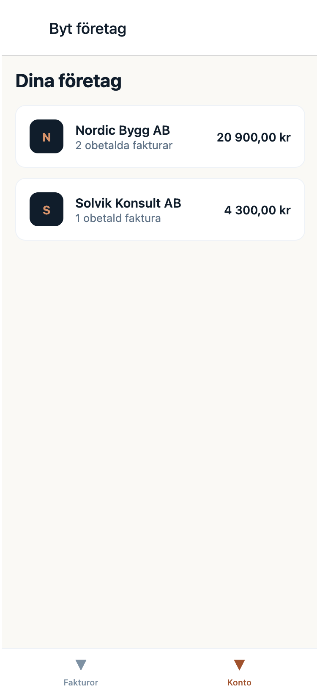

# faktureringssystem-native

Mobilklient till mitt fakturasystem, byggd i React Native/Expo. Samma backend och samma data som webbportalen, men gjord för telefon på riktigt istället för att bara krympa webben — Face ID-inloggning, haptisk feedback, native delning av fakturor som PDF, och lokala notiser när en faktura byter status.

<p>
  
  
  
  
</p>

## Vad man kan göra

Logga in, se sina fakturor, öppna eller dela en faktura som PDF, betala via Stripe Checkout, och byta mellan bolag om man är kopplad till fler än ett.

## Stack

Expo (SDK 57), React Navigation, TanStack Query, TypeScript. Valde React Navigation istället för Expo Router för att få en uttalad mappstruktur (`navigation/`, `screens/`) snarare än att routingen styrs av filsystemet — mer att skriva för hand, men lättare att följa när appen växer.

## Testa den utan backend

Appen pratar normalt med en riktig backend (`faktureringssystem-be`), men man behöver inte starta den bara för att kolla på appen:

```bash
npm install
npm run demo
```

Det startar appen i webbläsaren med en inbyggd fejk-API — valfri inloggning, två påhittade bolag med olika fakturastatusar, allt man ser på skärmdumparna ovan. Inget nätverksanrop lämnar datorn. PDF-öppning och betalning är avsiktligt inte simulerade (det finns ingen riktig fil eller betalning att simulera), så de visar samma felmeddelande som appen redan har för "inte tillgänglig än".

Samma flagga (`EXPO_PUBLIC_USE_MOCKS=true`) funkar för `npm run ios`/`android` också, se `src/api/mockData.ts` för fixturdatan.

## Köra mot en riktig backend

```bash
cp .env.example .env    # peka EXPO_PUBLIC_API_URL mot din egen faktureringssystem-be
npm run ios             # eller: npm run android / npm run web
```

Kräver en körande instans av backenden (`docker compose up -d` i det repot).

## Testa

```bash
npm test              # jest — 34 tester
npx tsc --noEmit       # typecheck
npm run lint           # eslint
```

Testerna ligger där buggar faktiskt gömmer sig: pengaformattering, token-refresh (inklusive vad som händer om flera anrop får 401 samtidigt), fejk-API:ets routing, och diff-logiken bakom notiserna. Jag har medvetet inte skrivit komponenttester för skärmarna — de är tunna wrappers runt native-API:er (kamera, Face ID, delningsmenyn) som är enklare att verifiera genom att köra appen än genom snapshots som ändå bara speglar koden.

Face ID, haptik, delning och notiser är native-only och går inte att testa i webbläsaren — kör `npm run ios` eller `npm run android` för att se dem på riktigt.
